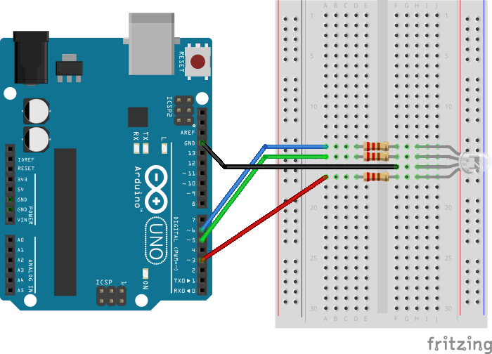
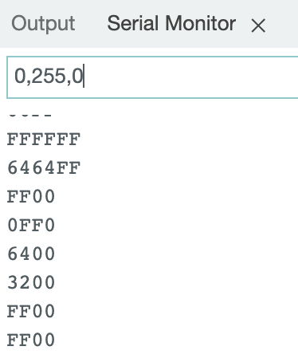
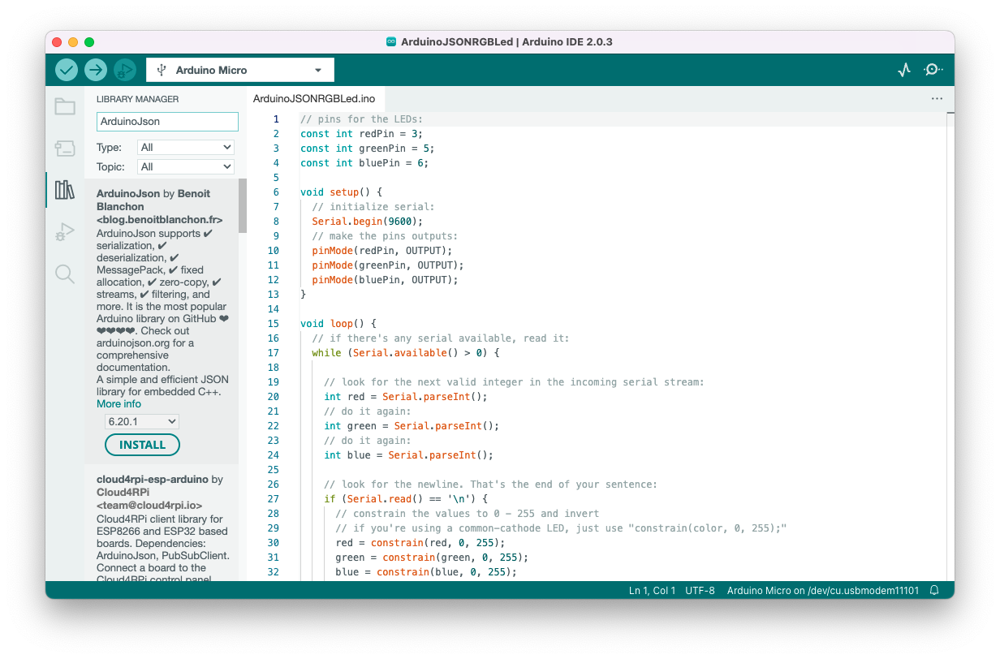

# Arduino

In this chapter we'll cover the basics of Arduino, and by using serial communication we can build interactive applications combining computer and Arduino interaction.

## What's Arduino?

Arduino is a collection of 3 tools, forming the Arduino Toolkit. First of all, there's the Arduino controller (hardware), which is available in many formats. The schematics are open source, and everybody can assemble them on their own if wanted. The second part of the Arduino Toolkit is the language and compiler. These enable you to write programs to execute by the controller. Lastly, we've got the Arduino IDE: the coding environment where you can write an Arduino program and upload to a controller.

The goal of Arduino is to enable people to easily build interactive installations, linking hardware and software together. You can read input from different kinds of sensors (push buttons, light sensors, temperature sensors, gyroscopes, distance sensors, ...) and control other electronics (leds, motors, ...)

## Installation and setup

You'll need an Arduino compatible board. You can check a list of supported boards at https://www.arduino.cc/en/Main/Products. We will be using an Arduino Micro board during this course. Next to a board, you'll need some LEDs, resistors, sensors, ...

Additionally, you'll need the Arduino IDE. Download the Arduino IDE at https://www.arduino.cc/en/Main/Software

### Hello Arduino

We'll do a first quick test of your Arduino board and the IDE. Open op the Arduino IDE. You'll be presented with a screen like the image below:


It consists of a large text area where you'll write your code, a button bar on top, a logging area below and a status bar.

We will try to blink an on-board LED on our Arduino.

1.  Copy / Paste the following code into our IDE:

```c
int RXLED = 17; // on an Arduino Micro, PIN 17 is an onboard LED pin

void setup() {
        pinMode(RXLED, OUTPUT);
}

void loop() {
        digitalWrite(RXLED, HIGH);
        delay(1000);
        digitalWrite(RXLED, LOW);
        delay(1000);
}
```

2.  Connect your Arduino Board on a free USB port.
3.  Make sure that `Tools > Board > Arduino AVR Boards > Arduino Micro` is selected in the menu.
4.  Make sure that a port with an Arduino is selected in `Tools > Port`. The usb port with the Arduino should mention something like "Arduino" at the end.
5.  Click on the right-pointing arrow button to upload the Sketch to the board.

If everything works as it should, you should see the onboard LED blink on the board!


Take a look at the code from this example. The language you write Arduino code in is the C programming language. We can identify a couple of parts in this Sketch:

- `void setup()`: The code in this function only runs once at startup of the program
- `void loop()`: The code in this function runs continuously. As soon as this function exits, it runs again. You can interpret this as some sort of endless loop.
- `pinMode`: By using this function you can configure a certain pin on the Arduino as either OUTPUT or INPUT. An output pin is used to drive an external component, whereas an INPUT pin is used to read a value from a pin (eg to read a sensor value).
- `digitalWrite`: We use this function to write a binary value (HIGH or LOW) to a given pin number.
- `delay`: This function pauses the execution of the program for a given amount of time in milliseconds.

## A first electrical circuit

Let's spice things up a little bit. Instead of blinking the on board LED, we'll connect a real LED to the Arduino.

To make an LED light up, it'll need electricity running through it. That electric current needs to flow from somewhere to a destination. Just like water in a river, it will flow from a high potential to a low potential. You'll need to be careful about the amount of current flowing through the LED at any given time. Just like with the river analogy, too much current / pressure might destroy a component (our LED). We will add a resistor to our circuit, to limit the current.

We've used a couple of terms in the paragraph above, which are expressed in different units:

- Voltage (V): the difference between the high and low potential in a circuit, expressed in Volts.
- Current (I): the amount of current flowing in a circuit, expressed in Ampere.
- Resistance (R): a resistance in a circuit, expressed in Ohms.

There is a close connection between these 3, expressed in Ohm's law. As you can read on the [Wikipedia page on Ohm's law](https://en.wikipedia.org/wiki/Ohm's_law): "Ohm's law states that the current through a conductor between two points is directly proportional to the voltage across the two points."


Where I stands for current, V for voltage and R for resistance.

### An LED in a circuit

When we want to connect an LED to an Arduino, we'd hook up the short side to a ground pin (GND) and the long side through a resistor to an output pin:


Most of the Arduino examples you'll find are shown with an Arduino UNO board. As we're using an Arduino Pro Micro board, you'll need to look for the same pin numbers or pins with the same functionality on your Arduino Pro Micro board:


We could get our hands dirty with a soldering iron, and melt wires and components together, but this would be a pretty slow prototyping / testing proces. Instead of that, we'll use a breadboard.

Breadboards make it easier to prototype electronic circuits. Make sure to [read the chapter "Anatomy of a breadboard" on the Sparkfun website](https://learn.sparkfun.com/tutorials/how-to-use-a-breadboard/#anatomy-of-a-breadboard) before continuing.

Build the circuit below using a breadboard and test the Blink example again (make sure the pin number in your code and the physical pin number match). The LED should turn on and off.


If it doesn't, check the following potential issues:

- The long connector from the LED should be connected to pin 13.
- The resistor should have a value below 1000 Ohms (1 KOhm). Resistance values can be read using the colored stripes on them (see [resistor-calculator.com](http://www.resistor-calculator.com/)). The one in the picture is a 220 Ohm resistor.

## Keyboard and Mouse Control

Our Arduino Pro Micro board has the capability of identifying itself as a keyboard and mouse. If all you need is basic input with some pushbuttons, this might be sufficient. Reading the Arduino input on your computer is just listening to keyboard / mouse events!

Let's play [the chrome dino game](chrome://dino) using your Arduino. You can play this game by pressing the spacebar on your keyboard. We'll build our own keyboard with Arduino!

- [Hook up a pushbutton to your Arduino](https://www.arduino.cc/en/Tutorial/BuiltInExamples/Button)
- Take a look at `File > Examples > 09. USB > KeyboardAndMouseControl`. Figure out what you need to put in the pushbutton code to send out a spacebar key code when pressing the button.

## Serial Communication

To communicate between a computer (webpage) and an Arduino we can use [Serial communication](https://www.arduino.cc/reference/en/language/functions/communication/serial/) and the [Web Serial API](https://caniuse.com/web-serial)

### Arduino Serial

There are a [lot of examples on the Arduino website](https://docs.arduino.cc/built-in-examples) that are using serial communication in some way or another.

Look for the Serial monitor in the Arduino IDE, open and Run `File > Examples > 04. Communication > ASCIITable` Can you see the ASCII table?

### Control RGB led through Serial

Let's try sending instructions to the Arduino using the Serial port.

Create the following circuit, using an RGB Common Cathode LED:

- red anode: digital pin 3 through 220 ohm resistor
- green anode: digital pin 5 through 220 ohm resistor
- blue anode: digital pin 6 through 220 ohm resistor
- cathode: GND



The goal is to control each individual color channel value through the Serial port.

Open `File > Examples > 04. Communication > ReadASCIIString` and explore the code. As we use a common cathode LED, we need to make one tweak to the source code (which is indicated in the source code):

Change

```diff
- red = 255 - constrain(red, 0, 255);
- green = 255 - constrain(green, 0, 255);
- blue = 255 - constrain(blue, 0, 255);

+ red = constrain(red, 0, 255);
+ green = constrain(green, 0, 255);
+ blue = constrain(blue, 0, 255);
```

Upload the sketch and open the Serial monitor. You should be able to pass 3 numbers between [0-255], separated by a comma to control the 3 color channels:



### Arduino & JSON

When building more complex circuits and interactions, you might run into limitations of just sending comma separated numbers...

Let's add JSON parsing functionality to our Arduino sketch, with [the ArduinoJSON library](https://arduinojson.org).

Save the previous ReadASCIIString as a different sketch with the name `ArduinoJSONRGBLed`.

Open the Library Manager in your Arduino IDE, and search for ArduinoJson:



Click **install** and wait for the installation to finish.

Next up, in the menu bar, click on `Sketch > Include Library > Arduino Json` to add the necessary header files to your Arduino sketch.

This should add the following two lines at the top of your sketch:

```c
#include <ArduinoJson.h>
#include <ArduinoJson.hpp>
```

Replace the `loop()` function with the following content, which just reads a full serial string:

```c
void loop() {
  // if there's any serial available, read it:
  if (Serial.available() > 0) {
    String s = Serial.readStringUntil('\n');
    Serial.print("received: ");
    Serial.println(s);
    // todo: parse here
  }
}
```

Take a look at [the arduinojson docs](https://arduinojson.org/v6/doc/) on how to implement deserialization, and see if you can get it working so that sending json strings such as `{"r": 255, "g": 255, "b": 0}` works to control the LED.

### Web Serial API

Using the Web Serial API, you can access Serial devices from JavaScript.

We will use our previous Arduino sketch **ArduinoJSONRGBLed** for this first experiment.

A great place to start is [the MDN page on the Web Serial API](https://developer.mozilla.org/en-US/docs/Web/API/Web_Serial_API). Also [take a look at this step-by-step guide](https://developer.chrome.com/articles/serial/) for extra pointers in the right direction.

As mentioned in the docs, you can only use Web Serial within a secure browser context (aka: https). So, first of all, set up a nodejs project with express, which launches an https server - [See the WebRTC chapter for that](../webrtc/)

Next up, [follow the step-by-step article on the chrome website](https://developer.chrome.com/articles/serial/).

Create an index.html file in your public folder, and use some boilerplate code to get started:
- placeholder divs for the two different states of the app (supported / not supported)
- placeholder divs for the connection status (connected / disconnected)
- boolean to check whether the Web Serial API is supported
- boolean to check whether the serial port is connected
- methods to toggle the visibility of the different divs

```html
<!DOCTYPE html>
<html lang="en">
<head>
  <meta charset="UTF-8">
  <meta name="viewport" content="width=device-width, initial-scale=1.0">
  <title>Arduino Web Serial</title>
</head>
<body>
  <div id="app">
    <div id="not-supported">
      Web Serial is not supported in this browser.
    </div>
    <div id="supported">
      <div id="not-connected">
        Not Connected
      </div>
      <div id="connected">
        Connected
      </div>
    </div>
  </div>
  <script type="module">

    // app state
    const hasWebSerial = "serial" in navigator;
    let isConnected = false;

    const $notSupported = document.getElementById("not-supported");
    const $supported = document.getElementById("supported");
    const $notConnected = document.getElementById("not-connected");
    const $connected = document.getElementById("connected");

    const init = async () => {
      displaySupportedState();
      if (!hasWebSerial) return;
      displayConnectionState();
    };

    const displaySupportedState = () => {
      if (hasWebSerial) {
        $notSupported.style.display = "none";
        $supported.style.display = "block";
      } else {
        $notSupported.style.display = "block";
        $supported.style.display = "none";
      }
    }

    const displayConnectionState = () => {
      if (isConnected) {
        $notConnected.style.display = "none";
        $connected.style.display = "block";
      } else {
        $notConnected.style.display = "block";
        $connected.style.display = "none";
      }
    }

    init();

  </script>
</body>
</html>
```

At time of writing, only Chrome, Edge and Opera supported the Web Serial API, so make sure to use one of those browsers. The early `return` in the init function will make sure that the app doesn't run in other browsers.

As [seen on the MDN Web Serial API](https://developer.mozilla.org/en-US/docs/Web/API/Web_Serial_API) page, we can get a list of available ports using the `navigator.serial.getPorts()` method, and keep track of connected ports using the `navigator.serial.addEventListener('connect')` and `navigator.serial.addEventListener('disconnect')` methods.

Add the following logic to our `init()` function:

```javascript
navigator.serial.addEventListener('connect', (e) => {
  const port = e.target;
  const info = port.getInfo();
  console.log('connect', port, info);
});

navigator.serial.addEventListener('disconnect', (e) => {
  const port = e.target;
  const info = port.getInfo();
  console.log('disconnect', port, info);
});

const ports = await navigator.serial.getPorts();

console.log('Ports');
ports.forEach(port => {
  const info = port.getInfo();
  console.log(info);
});
```

Run the app, with your arduino connected. We don't see any ports logged yet: this is because we need to request access to the port first, using the `navigator.serial.requestPort()` method.

Try adding the requestPort method at the end of the init() function, and run the app again. This doesn't work either: we get an error in our console:

> Uncaught (in promise) DOMException:
> The requestPort() method must be called in response to a user gesture.

The method `Serial.requestPort()` must be called on a user interaction. This is why we have a button on our page.

Add a button to the `not-connected` div (doing it in the html is fine, as we toggle the div visibility), and attach a click event listener to it:

```javascript
$connectButton.addEventListener("click", handleClickConnect);
```

```javascript
const handleClickConnect = async () => {
  const port = await navigator.serial.requestPort();
  console.log(port);
  const info = port.getInfo();
  console.log(info);
};
```

Test the button: you should see a browser dialog askint to select a port, after selecting the port, you should see some general information.

> There can be only one serial connection at a time. Remember this when you're trying to upload a new sketch while a browser is already connected to the serial port or when the Serial monitor is open in the Arduino IDE...

Once we have a port, we can setup our serial connection, using the same baudRate we specified in our Arduino sketch. Make sure to update the connection status boolean, and toggle the visibility of the divs:

```javascript
isConnected = true;
displayConnectionState();
await port.open({ baudRate: 9600 });
```

A serial port sends `Uint8Array` objects over the wire. To convert our JSON strings to these arrays, we'll use an additional TextEncoder:

```javascript
const textEncoder = new TextEncoderStream();
const writableStreamClosed = textEncoder.readable.pipeTo(port.writable);
const writer = textEncoder.writable.getWriter();
```

We can then use this write object, to send the serial strings. For example, let's send a random color json every second:

```javascript
setInterval(async () => {
  await writer.write(JSON.stringify({
    r: Math.floor(Math.random()*255),
    g: Math.floor(Math.random()*255),
    b: Math.floor(Math.random()*255),
  }));
  await writer.write("\n");
}, 1000);
```

**note the additional line break `\n` - do you know why we are adding this? Hint: take a look at our Arduino sketch...**

Test the app - the RGB led should change color every second.

Listen for the `disconnected` event on the port, and toggle the connect button visibility. Try unplugging the arduino while the app is running, to check if everything remains stable.

```javascript
port.addEventListener("disconnect", () => {
  console.log("Disconnected");
  isConnected = false;
  displayConnectionState();
});
```

Now that we have a port linked to our app, you'll notice that the port logging logic in the `init()` function is also triggered. We can now add some extra, auto-connect logic to our app.

Move the connection logic (setting up the baudRate, stream writer and disconnect logic) to a separate connect function, and call that function from the `handleClickConnect` function:

```javascript
const handleClickConnect = async () => {
  const port = await navigator.serial.requestPort();
  console.log(port);
  const info = port.getInfo();
  console.log(info);
  await connect(port);
};

const connect = async (port) => {
  isConnected = true;
  displayConnectionState();

  await port.open({ baudRate: 9600 });

  const textEncoder = new TextEncoderStream();
  const writableStreamClosed = textEncoder.readable.pipeTo(port.writable);
  const writer = textEncoder.writable.getWriter();
  setInterval(async () => {
    await writer.write(JSON.stringify({
      r: Math.floor(Math.random()*255),
      g: Math.floor(Math.random()*255),
      b: Math.floor(Math.random()*255),
    }));
    await writer.write("\n");
  }, 1000);

  port.addEventListener("disconnect", () => {
    console.log("Disconnected");
    isConnected = false;
    displayConnectionState();
  });
}
```

At the end of our init function, where we have a list of ports, we can now also call the connect function when we have a port:

```javascript
if (ports.length > 0) {
  connect(ports[0]);
}
```

Run the app, and check if the connection is established automatically.

Let' make sure we can unplug / replug the arduino, and the app will reconnect automatically.

In our connect handler, we can now call this same connect function when no connection is active yet:

```javascript
navigator.serial.addEventListener('connect', (e) => {
  const port = e.target;
  const info = port.getInfo();
  console.log('connect', port, info);
  if (!isConnected) {
    connect(port);
  }
});
```

If you have multiple serial devices connected to a web page, chance exists that the app doesn't connect to the correct device. You'll have noticed that we are logging some port info (usbProductId and usbVendorId) in the console. We can use this to filter the ports we want to connect to.

- Keep track of the "Arduino" ports, by using the `usbProductId` and `usbVendorId` properties.
- Change the app, and try controlling the RGB color using a color picker or sliders. You will probably need to move the port, writableStreamClosed and writer to the global scope.

## Components to test

You've got a lot of different components in your kit. Build and test the following examples, try to include some logging via Serial.

### Inputs

- Button: <https://docs.arduino.cc/built-in-examples/digital/Button>
- Potentiometer: <https://docs.arduino.cc/built-in-examples/basics/AnalogReadSerial> - try this out with the joystick from your kit as well! The joystick is a combination of 2 potentionmeters and one push button.
- Photoresistor: <https://create.arduino.cc/projecthub/MisterBotBreak/how-to-use-a-photoresistor-46c5eb>. You can use this to create a laser-tripwire (<https://create.arduino.cc/projecthub/digitalfendi/super-simple-fun-laser-tripwire-aa56c9>), ask the professor for a laser diode to play with.
- Ultrasonic Sensor: <https://docs.arduino.cc/built-in-examples/sensors/Ping>

### Outputs

- Piezzo sound: <https://docs.arduino.cc/built-in-examples/digital/toneMelody>
- DC motor: <https://learn.adafruit.com/adafruit-arduino-lesson-13-dc-motors/>
- Servo motor(ask the professor for a servo to play with): <https://learn.adafruit.com/adafruit-arduino-lesson-14-servo-motors>

### Combinations

Use your imagination to combine inputs with outputs. Sound a piezzo alarm when the laser tripwire gets triggered. Control a servo angle based on the distance of your ultrasonic sensor. Use the joystick as a speed controller for your DC motor.

By using serial communication, you can combine the hardware with browser logic. Make sure to try the following projects:

1. Change a servo angle based on the x position of your mouse pointer on the screen
2. Control the background color of your `<body>` tag using a potentiometer or a light sensor
3. Build a basic arcade game (pong, breakout) and control it using an Arduino sensor

## Other things to check

- [VS Code Arduino Extension](https://marketplace.visualstudio.com/items?itemName=vsciot-vscode.vscode-arduino)
- [View Arduino, The documentary](https://vimeo.com/18539129) (28 min)
- [DIY Pressure Sensor](https://www.youtube.com/watch?v=_RUZtsQzSLY)
- [Star Wars Imperial March with Floppy and Arduino](https://www.youtube.com/watch?v=B_Q6jMUdfYc)
- [The breakfast machine](https://www.youtube.com/watch?v=E2evC2xTNWg)
- [Lunar Trails](https://vimeo.com/54043239)
- [NES Zapper Gun hack](https://vimeo.com/181220188)
- [NIghtwriter Nyx](http://www.gijsvanbon.nl/nyx1.html)
- [Whiteboard Clock](https://www.youtube.com/watch?v=4QgeQAiSmM8)
- [Neil Mendoza](http://www.neilmendoza.com/)
- [Anouk Wipprecht](http://www.anoukwipprecht.nl/gallery)
