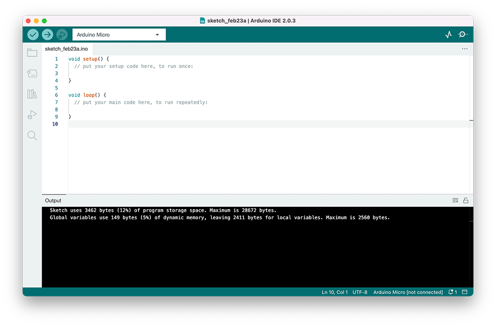
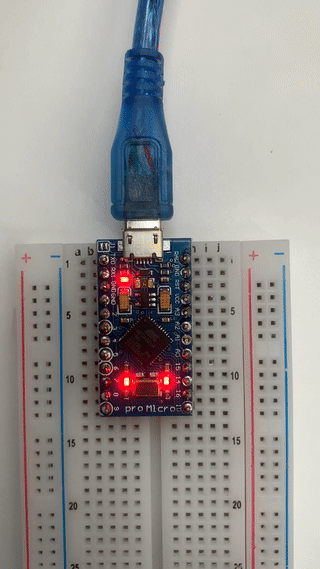
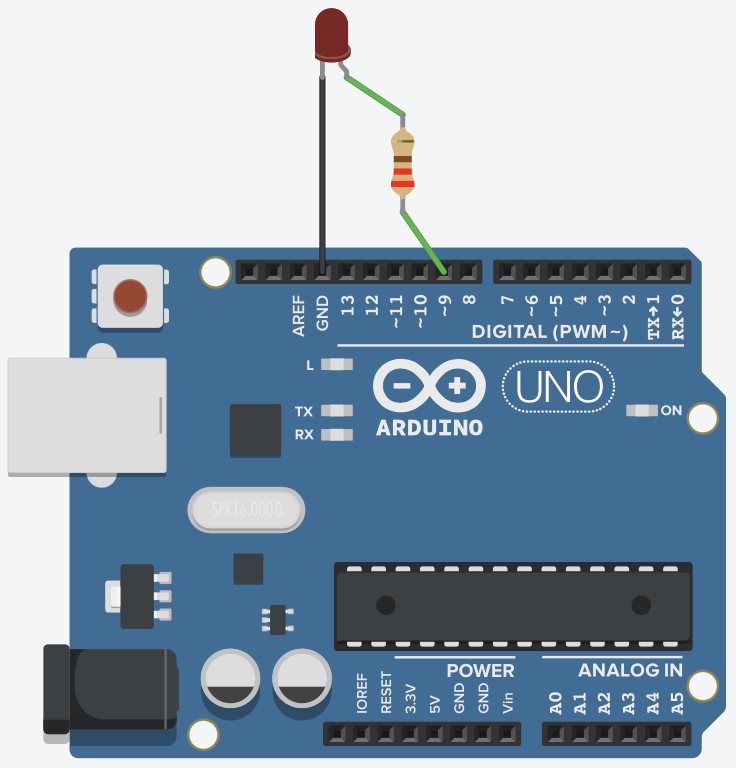
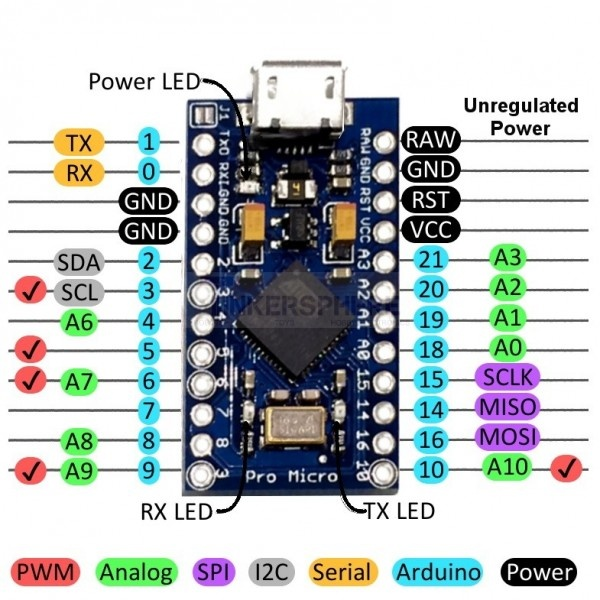
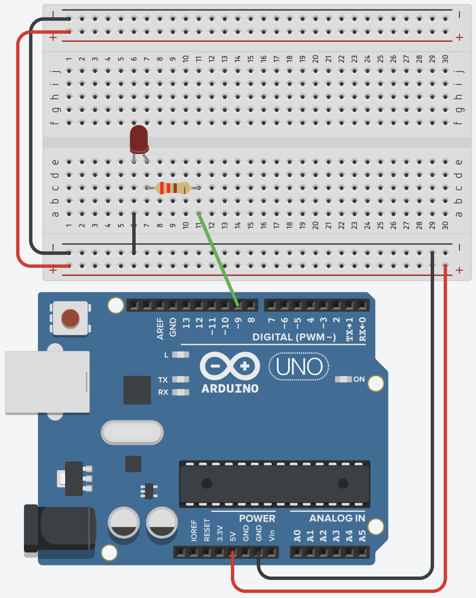

# Arduino

In this chapter we'll cover the basics of Arduino, and by using serial communication we can build interactive applications combining computer and Arduino interaction.

## What's Arduino?

Arduino is a collection of 3 tools, forming the Arduino Toolkit. First of all, there's the Arduino controller (hardware), which is available in many formats. The schematics are open source, and everybody can assemble them on their own if wanted. The second part of the Arduino Toolkit is the language and compiler. These enable you to write programs to execute by the controller. Lastly, we've got the Arduino IDE: the coding environment where you can write an Arduino program and upload to a controller.

The goal of Arduino is to enable people to easily build interactive installations, linking hardware and software together. You can read input from different kinds of sensors (push buttons, light sensors, temperature sensors, gyroscopes, distance sensors, ...) and control other electronics (leds, motors, ...)

## Installation and setup

You'll need an Arduino compatible board. You can check a list of supported boards at https://www.arduino.cc/en/Main/Products. We will be using an Arduino Micro board during this course. Next to a board, you'll need some LEDs, resistors, sensors, ...

Additionally, you'll need the Arduino IDE. Download the Arduino IDE at https://www.arduino.cc/en/Main/Software

### Hello Arduino

We'll do a first quick test of your Arduino board and the IDE. Open op the Arduino IDE. You'll be presented with a screen like the image below:



It consists of a large text area where you'll write your code, a button bar on top, a logging area below and a status bar.

We will try to blink an on-board LED on our Arduino.

1.  Copy / Paste the following code into our IDE:

```c
int RXLED = 17; // on an Arduino Micro, PIN 17 is an onboard LED pin

void setup() {
        pinMode(RXLED, OUTPUT);
}

void loop() {
        digitalWrite(RXLED, HIGH);
        delay(1000);
        digitalWrite(RXLED, LOW);
        delay(1000);
}
```

2.  Connect your Arduino Board on a free USB port.
3.  Make sure that `Tools > Board > Arduino AVR Boards > Arduino Micro` is selected in the menu.
4.  Make sure that a port with an Arduino is selected in `Tools > Port`. The usb port with the Arduino should mention something like "Arduino" at the end.
5.  Click on the right-pointing arrow button to upload the Sketch to the board.

If everything works as it should, you should see the onboard LED blink on the board!



Take a look at the code from this example. The language you write Arduino code in is the C programming language. We can identify a couple of parts in this Sketch:

- `void setup()`: The code in this function only runs once at startup of the program
- `void loop()`: The code in this function runs continuously. As soon as this function exits, it runs again. You can interpret this as some sort of endless loop.
- `pinMode`: By using this function you can configure a certain pin on the Arduino as either OUTPUT or INPUT. An output pin is used to drive an external component, whereas an INPUT pin is used to read a value from a pin (eg to read a sensor value).
- `digitalWrite`: We use this function to write a binary value (HIGH or LOW) to a given pin number.
- `delay`: This function pauses the execution of the program for a given amount of time in milliseconds.

## A first electrical circuit

Let's spice things up a little bit. Instead of blinking the on board LED, we'll connect a real LED to the Arduino.

To make an LED light up, it'll need electricity running through it. That electric current needs to flow from somewhere to a destination. Just like water in a river, it will flow from a high potential to a low potential. You'll need to be careful about the amount of current flowing through the LED at any given time. Just like with the river analogy, too much current / pressure might destroy a component (our LED). We will add a resistor to our circuit, to limit the current.

We've used a couple of terms in the paragraph above, which are expressed in different units:

- Voltage (V): the difference between the high and low potential in a circuit, expressed in Volts.
- Current (I): the amount of current flowing in a circuit, expressed in Ampere.
- Resistance (R): a resistance in a circuit, expressed in Ohms.

There is a close connection between these 3, expressed in Ohm's law. As you can read on the [Wikipedia page on Ohm's law](https://en.wikipedia.org/wiki/Ohm's_law): "Ohm's law states that the current through a conductor between two points is directly proportional to the voltage across the two points."


Where I stands for current, V for voltage and R for resistance.

### An LED in a circuit

When we want to connect an LED to an Arduino, we'd hook up the short side to a ground pin (GND) and the long side through a resistor to an output pin:



Most of the Arduino examples you'll find are shown with an Arduino UNO board. As we're using an Arduino Pro Micro board, you'll need to look for the same pin numbers or pins with the same functionality on your Arduino Pro Micro board:



We could get our hands dirty with a soldering iron, and melt wires and components together, but this would be a pretty slow prototyping / testing proces. Instead of that, we'll use a breadboard.

Breadboards make it easier to prototype electronic circuits. Make sure to [read the chapter "Anatomy of a breadboard" on the Sparkfun website](https://learn.sparkfun.com/tutorials/how-to-use-a-breadboard/#anatomy-of-a-breadboard) before continuing.

Build the circuit below using a breadboard and test the Blink example again (make sure the pin number in your code and the physical pin number match). The LED should turn on and off.



If it doesn't, check the following potential issues:

- The long connector from the LED should be connected to pin 13.
- The resistor should have a value below 1000 Ohms (1 KOhm). Resistance values can be read using the colored stripes on them (see [resistor-calculator.com](http://www.resistor-calculator.com/)). The one in the picture is a 220 Ohm resistor.

## Keyboard and Mouse Control

Our Arduino Pro Micro board has the capability of identifying itself as a keyboard and mouse. If all you need is basic input with some pushbuttons, this might be sufficient. Reading the Arduino input on your computer is just listening to keyboard / mouse events!

Let's play [the chrome dino game](chrome://dino) using your Arduino. You can play this game by pressing the spacebar on your keyboard. We'll build our own keyboard with Arduino!

- [Hook up a pushbutton to your Arduino](https://www.arduino.cc/en/Tutorial/BuiltInExamples/Button)
- Take a look at File > Examples > USB > KeyboardAndMouseControl. Figure out what you need to put in the pushbutton code to send out a spacebar key code when pressing the button.

## Serial Communication

To communicate between a computer (webpage) and an Arduino we can use [Serial communication](https://www.arduino.cc/reference/en/language/functions/communication/serial/) and the [Web Serial API](https://caniuse.com/web-serial)

### Arduino Serial

There are a [lot of examples on the Arduino website](https://docs.arduino.cc/built-in-examples) that are using serial communication in some way or another.

Look for the Serial monitor in the Arduino IDE and run [this example](https://docs.arduino.cc/built-in-examples/communication/ASCIITable) Can you see the ASCII table?

One important thing to be aware of, is the type of communication. This can be binary or text based. If you only need to send a couple of values, binary (the default) can be sufficient. When you need to send a lot of values and/or commands, it might be worth it to use text based communication and come up with some kind of protocol.
Have a look at the difference between [write()](https://www.arduino.cc/reference/en/language/functions/communication/serial/write/) and [print()](https://www.arduino.cc/reference/en/language/functions/communication/serial/print/)

### Web Serial API

A great place to start is [the MDN page on the Web Serial API](https://developer.mozilla.org/en-US/docs/Web/API/Web_Serial_API)

Some general advice:

- The Web Serial API is not yet supported by all browsers. So don't forget to check this first.
- The method `Serial.requestPort()` must be called on a user interaction.
- There can be only one serial connection at a time. Remember this when you're trying to upload a new sketch while a browser is already connected to the serial port. Or when the Serial monitor is open...

To get you started, you can use the lib provided here [https://github.com/devinekask/Arduino-serial](https://github.com/devinekask/Arduino-serial) Be aware this is only a starter, you'll probably need to make some adjustments to get everything working as expected.

## Components to test

You've got a lot of different components in your kit. Build and test the following examples, try to include some logging via Serial.

### Inputs

- Button: <https://docs.arduino.cc/built-in-examples/digital/Button>
- Potentiometer: <https://docs.arduino.cc/built-in-examples/basics/AnalogReadSerial> - try this out with the joystick from your kit as well! The joystick is a combination of 2 potentionmeters and one push button.
- Photoresistor: <https://create.arduino.cc/projecthub/MisterBotBreak/how-to-use-a-photoresistor-46c5eb>. You can use this to create a laser-tripwire (<https://create.arduino.cc/projecthub/digitalfendi/super-simple-fun-laser-tripwire-aa56c9>), ask the professor for a laser diode to play with.
- Ultrasonic Sensor: <https://docs.arduino.cc/built-in-examples/sensors/Ping>

### Outputs

- Piezzo sound: <https://docs.arduino.cc/built-in-examples/digital/toneMelody>
- DC motor: <https://learn.adafruit.com/adafruit-arduino-lesson-13-dc-motors/>
- Servo motor(ask the professor for a servo to play with): <https://learn.adafruit.com/adafruit-arduino-lesson-14-servo-motors>

### Combinations

Use your imagination to combine inputs with outputs. Sound a piezzo alarm when the laser tripwire gets triggered. Control a servo angle based on the distance of your ultrasonic sensor. Use the joystick as a speed controller for your DC motor.

By using serial communication, you can combine the hardware with browser logic. Make sure to try the following projects:

1. Fade an LED using an `<input type="range">`
2. Change a servo angle based on the x position of your mouse pointer on the screen
3. Control the background color of your `<body>` tag using a potentiometer or a light sensor
4. Build a basic arcade game (pong, breakout) and control it using an Arduino sensor

## Other things to check

- [VS Code Arduino Extension](https://marketplace.visualstudio.com/items?itemName=vsciot-vscode.vscode-arduino)
- [View Arduino, The documentary](https://vimeo.com/18539129) (28 min)
- [DIY Pressure Sensor](https://www.youtube.com/watch?v=_RUZtsQzSLY)
- [Star Wars Imperial March with Floppy and Arduino](https://www.youtube.com/watch?v=B_Q6jMUdfYc)
- [The breakfast machine](https://www.youtube.com/watch?v=E2evC2xTNWg)
- [Lunar Trails](https://vimeo.com/54043239)
- [NES Zapper Gun hack](https://vimeo.com/181220188)
- [NIghtwriter Nyx](http://www.gijsvanbon.nl/nyx1.html)
- [Whiteboard Clock](https://www.youtube.com/watch?v=4QgeQAiSmM8)
- [Neil Mendoza](http://www.neilmendoza.com/)
- [Anouk Wipprecht](http://www.anoukwipprecht.nl/gallery)
