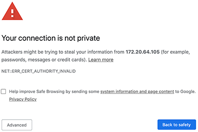
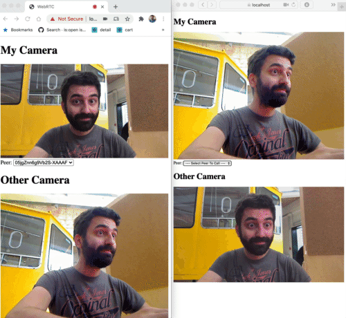

# WebRTC

In this chapter we're going to cover real-time audio & video communication using WebRTC.

There are walk-through videos available on our Canvas Learning Platform where we go through this material & exercises step-by-step.

# Intro

As you can read on https://developer.mozilla.org/en-US/docs/Web/API/WebRTC_API:

> **WebRTC** (Web Real-Time Communications) is a technology which enables Web applications and sites to capture and optionally stream audio and/or video media, as well as to exchange arbitrary data between browsers without requiring an intermediary. The set of standards that comprise WebRTC makes it possible to share data and perform teleconferencing peer-to-peer, without requiring that the user installs plug-ins or any other third-party software.

## Accessing your webcam from javascript

Create a new project, with an express server and a static public folder. Inside of the folder, you'll create an index.html and a video tag.

```html
<!DOCTYPE html>
<html lang="en">
<head>
  <meta charset="UTF-8">
  <meta name="viewport" content="width=device-width, initial-scale=1.0">
  <meta http-equiv="X-UA-Compatible" content="ie=edge">
  <title>Webcam</title>
</head>
<body>
  <video id="video" autoplay playsinline></video>
</body>
</html>
```

The API call we will use to access the webcam is [MediaDevices.getUserMedia()](https://developer.mozilla.org/en-US/docs/Web/API/MediaDevices/getUserMedia). 

Let's show our webcam stream in the video tag:

```javascript
const $video = document.getElementById('video');

const init = async () => {
  const constraints = {
    audio: false,
    video: true
  };
  const stream = await navigator.mediaDevices.getUserMedia(constraints);
  $video.srcObject = stream;
};

init();
```

Test the app, you should see your webcam feed in the browser.
[Read up upon the constraints option](https://developer.mozilla.org/en-US/docs/Web/API/MediaDevices/getUserMedia#Parameters) - which allows you to specify preferred resolutions and cameras.

### Security

Viewing the app through localhost works like a charm. However, if you try accessing the page through your ip address, it won't work:

> (index):21 Uncaught (in promise) TypeError: Cannot read property 'getUserMedia' of undefined

Webcam access is disabled on non-secure (aka non-https) origins. If you'd want to test your app on your smartphone, accessing it through your laptop's ip address, you'll need to run an http***s*** server.

First of all, you'll need to [create a self-signed SSL certificate](https://letsencrypt.org/docs/certificates-for-localhost/#making-and-trusting-your-own-certificates). Open up a terminal, navigate to your project root and execute the command below to create a certificate with accompanying private key.

```bash
openssl req -x509 -out localhost.crt -keyout localhost.key \
  -newkey rsa:2048 -nodes -sha256 \
  -subj '/CN=localhost' -extensions EXT -config <( \
   printf "[dn]\nCN=localhost\n[req]\ndistinguished_name = dn\n[EXT]\nsubjectAltName=DNS:localhost\nkeyUsage=digitalSignature\nextendedKeyUsage=serverAuth")
```

Update the server initialization code to use the SSL certificate:

```javascript
const fs = require('fs');
const options = {
  key: fs.readFileSync('./localhost.key'),
  cert: fs.readFileSync('./localhost.cert')
};
const server = require('https').Server(options, app); // httpS instead of http
```

Start the server and test the app through the IP address and https (e.g https://172.20.64.105:8080/). You should see a warning message (screenshot from Google Chrome):



Click "Advanced"... and choose to proceed to the page. You should be able to access the webcam now.

Try accessing it on your smartphone, through the IP address. See if you can force the webcam to use the front or back facing camera of your phone, by setting the constraints in the code.

### Deploying the app

When deploying the app, you'll probably have https running on your server already. In that scenario, you don't need to load the SSL certificate in your code.

To differentiate between development (local) and production (online), you can create a .env settings file where you set your NODE_ENV to development:

```
NODE_ENV=development
```

Add the `node-env` npm package to your project to load this file:

```bash
npm install node-env --save
```

And load the file on the very first line of the server's nodejs logic:

```javascript
require('dotenv').config();
```

Create a boolean where you check if you're running in development or production mode:

```javascript
const isDevelopment = (process.env.NODE_ENV === 'development');
```

and use that boolean check to tweak the server startup:

```javascript
let options = {};
if (isDevelopment) {
  options = {
    key: fs.readFileSync('./localhost.key'),
    cert: fs.readFileSync('./localhost.crt')
  };
}

const server = require(isDevelopment ? 'https' : 'http').Server(options, app);
```

Note that it'll use `http` in production mode: on servers like heroku, SSL termination is done on Heroku servers/load-balancers before the traffic gets to your application.

Finally, make sure to have the .env file and certificate files in a .gitignore:

```
*.crt
*.key
.env
```

Test deployment of your app to an online server, e.g. heroku.

## Peer to peer media streaming

What if we want to send our webcam feed to another computer over the internet? We will need to make sure the two computers know how to connect to eachother, what video codecs they support and open a communication channel to stream the data to one another.

First of all, [read through "Lifetime of a WebRTC session](https://developer.mozilla.org/en-US/docs/Web/API/WebRTC_API/Session_lifetime#Establishing_a_connection) to familiarize yourself with a couple of concepts and how a WebRTC session is set up.

### Creating a signalling server

Crucial to WebRTC peer to peer communication is a signalling service. We'll build this using socket.io.

This server needs to facilitate 3 types of messages:

1. Sending an offer from client A to client B
2. Sending an answer to an offer from client B back to client A
3. Sending ice candidate information between both clients

Duplicate the previous project where you had a basic https express server. Add socket.io to the project, and setup these 3 different message types.

```javascript
const clients = {};
io.on('connection', socket => {
  clients[socket.id] = { id: socket.id };

  socket.on('disconnect', () => {
    delete clients[socket.id];
    io.emit('clients', clients);
  });

  socket.on('peerOffer', (peerId, offer) => {
    console.log(`Received peerOffer from ${socket.id} to ${peerId}`);
    io.to(peerId).emit('peerOffer', peerId, offer, socket.id);
  });

  socket.on('peerAnswer', (peerId, answer) => {
    console.log(`Received peerAnswer from ${socket.id} to ${peerId}`);
    io.to(peerId).emit('peerAnswer', peerId, answer, socket.id);
  });

  socket.on('peerIce', (peerId, candidate) => {
    console.log(`Received peerIce from ${socket.id} to ${peerId}`);
    io.to(peerId).emit('peerIce', peerId, candidate, socket.id);
  });

  io.emit('clients', clients);

});
```

Note that there's also logic in place to manage all connected clients in a lookup object and broadcasts of all clients happens when connecting and disconnecting (the `io.emit('clients', clients);` calls).

### Connecting to the signalling server

As a first exploration of WebRTC, we'll be working with a sender app and a receiver app.

The sender app will have the logic to reach out to another connected client (receiver) to setup a call. The receiver app will answer an incoming call.

### Sender application

Create a `sender.html` in the public folder:

```html
<!DOCTYPE html>
<html lang="en">
<head>
  <meta charset="UTF-8">
  <meta name="viewport" content="width=device-width, initial-scale=1.0">
  <title>WebRTC</title>
  <style>
    video {
      max-width: 100%;
      height: auto;
    }
  </style>
</head>
<body>
  <h1>Sender</h1>
  <video id="myCamera" playsinline autoplay muted></video>
  <label for="peerSelect">Peer: </label><select id="peerSelect"></select>

  <script src="/socket.io/socket.io.js"></script>
  <script type="module">

    const $myCamera = document.getElementById('myCamera');
    const $peerSelect = document.getElementById('peerSelect');

    let socket;
    let myStream;
    let peerConnection;

    const servers = {
      iceServers: [{
        urls: 'stun:stun.l.google.com:19302'
      }]
    };

    const init = async () => {
      initSocket();
      const constraints = { audio: true, video: { width: 1280, height: 720 } };
      myStream = await navigator.mediaDevices.getUserMedia(constraints);
      $myCamera.srcObject = myStream;
    };

    const initSocket = () => {
      socket = io.connect('/');
      socket.on('connect', () => {
        console.log(socket.id);
      });
    };

    init();

  </script>
</body>
</html>
```

Make sure the server is running and open up https://localhost/sender.html. You should see your webcam, and in the devtools console your socket id should appear.

### Display all connected clients

In the select element, the other connected client ids should appear. Selecting a client should initiate a call.

Add a listener for the `clients` event on the socket:

```javascript
socket.on('clients', updatePeerList);
```

Write that updatePeerList function so that:

- You create an option for every client id in the clients object (Hint: use a for...in loop). Use the client's id as the value AND the label for each option.
- Don't create an option for your own socket id (Hint: compare socket.id with the client's id)
- Create an option with an empty value, with the text "Select Peer To Call"
- Add an event listener to the `input` event of the select box
- In the event handler you'll log the value of the select

Try coming up with the solution yourself before looking at a possible implementation below. Test the application with at least two browser windows, so you'll see the other socket / client ids.

```javascript
const updatePeerList = (clients) => {
  $peerSelect.innerHTML = '<option value="none">--- Select Peer To Call ---</option>';
  for (const clientId in clients) {
    const isMyOwnId = (clientId === socket.id);
    if (clients.hasOwnProperty(clientId) && !isMyOwnId) {
      const client = clients[clientId];
      const $option = document.createElement('option');
      $option.value = clientId;
      $option.textContent = clientId;
      $peerSelect.appendChild($option);
    }
  }
};
```

```javascript
// somewhere in your init function
$peerSelect.addEventListener('input', callSelectedPeer);
```

```javascript
const callSelectedPeer = () => {
  console.log('call selected peer', $peerSelect.value);
};
```

### Initiating the call

When we select an other client, we should:

- Create an RTCPeerConnection
- Create an "offer"
- Send that offer over the websocket server (aka the signalling server)

Create a new function `callPeer`, which takes a peer id (aka socket id) as a parameter:

```javascript
const callPeer = (peerId) => {
  peerConnection = new RTCPeerConnection(servers);
};
```

You can create an offer using the `.createOffer()` method on an RTCPeerconnection instance. [Take a look at the docs of the createOffer method](https://developer.mozilla.org/en-US/docs/Web/API/RTCPeerConnection/createOffer). You'll see that it returns a promise:

> _aPromise = myPeerConnection.createOffer([options]);_

In order to "await" this promise to resolve, you'll need to set the callPeer method as async:

```javascript
const callPeer = async (peerId) => {
```

In the callPeer method, you can now create the offer, link it as the local description of the connection and send it over the websocket connection, through the server, to the other client:

```javascript
const offer = await peerConnection.createOffer();
await peerConnection.setLocalDescription(offer);
socket.emit('peerOffer', peerId, offer);
```

Finally, make sure to execute the callPeer method from the selection input handler:

```javascript
const callSelectedPeer = async () => {
  console.log('call selected peer', $peerSelect.value);
  callPeer($peerSelect.value);
};
```

Test the app with two windows and select a socket id from the selection list. You should see the peerOffer appear in the server console.

### Answer the call

We'll now start our receiver app. Create a new html file called `receiver.html`:

```html
<!DOCTYPE html>
<html lang="en">
<head>
  <meta charset="UTF-8">
  <meta name="viewport" content="width=device-width, initial-scale=1.0">
  <title>WebRTC</title>
  <style>
    video {
      max-width: 100%;
      height: auto;
    }
  </style>
</head>
<body>
  <h1>Receiver</h1>
  <video id="otherCamera" playsinline autoplay muted></video>
  <script src="/socket.io/socket.io.js"></script>
  <script type="module">

    const $otherCamera = document.getElementById('otherCamera');

    let socket;
    let peerConnection;

    const servers = {
      iceServers: [{
        urls: `stun:stun.l.google.com:19302`
      }]
    };

    const init = async () => {
      initSocket();
    };

    const initSocket = () => {
      socket = io.connect(`/`);
      socket.on(`connect`, () => {
        console.log(socket.id);
      });
    };

    init();

  </script>
</body>
</html>
```

Listen for the `peerOffer` event on the socket instance:

```javascript
socket.on('peerOffer', (myId, offer, peerId) => {
  console.log(`Received peerOffer from ${peerId}`);
});
```

Open the `sender.html` in one browser window and the `receiver.html` in another window. When selecting the socket id in the sender, you should see the "received peerOffer" log appear in the receiver.html

Create a new method `answerPeerOffer` where you initiate the peerConnection. Make it async, as we'll use promise based calls:

```javascript
const answerPeerOffer = async (myId, offer, peerId) => {
  peerConnection = new RTCPeerConnection(servers);
};
```

Here the order is a little bit different than on the sender side. First of all, you'll need to set the "remote description" to be the incoming offer:

```javascript
await peerConnection.setRemoteDescription(offer);
```

then you'll need to create the answer and set that as the local description:

```javascript
const answer = await peerConnection.createAnswer();
await peerConnection.setLocalDescription(answer);
```

and finally you'll need to send this answer over the socket to the sender:

```javascript
socket.emit(`peerAnswer`, peerId, answer);
```

Make sure to call the `answerPeerOffer` method from the `peerOffer` socket event handler:

```javascript
socket.on('peerOffer', (myId, offer, peerId) => {
  console.log(`Received peerOffer from ${peerId}`);
  answerPeerOffer(myId, offer, peerId);
});
```

Test the app again with `sender.html` and `receiver.html`. When initiating a call using the select box, you should see the offer appear in the receiver and the answer to the offer back in the sender.

### Adding the streaming logic

To send a video / audio stream between the two peers, we'll need to do a few more things. The first thing is to make sure the ICE candidate information is sent between the two parties.

Both `sender.html` and `receiver.html` need to listen for ice candidates on the peerConnection. Add this logic right after you created the peerConnection instance:

```javascript
peerConnection.onicecandidate = (e) => {
  console.log('ice candidate', e.candidate);
  socket.emit('peerIce', peerId, e.candidate);
};
```

Handle the incoming `peerIce` events on the socket instance (again in both the `sender.html` and `receiver.html`):

```javascript
socket.on('peerIce', async (myId, candidate, peerId) => {
  console.log(`Received peerIce from ${peerId}`, candidate);
  await handlePeerIce(myId, candidate, peerId);
});
```

The handlePeerIce function should add the incoming candidate to the RTCPeerConnection instance:

```javascript
const handlePeerIce = async (myId, candidate, peerId) => {
  if (!candidate) {
    return;
  }
  await peerConnection.addIceCandidate(candidate);
};
```

We're almost there. In the `sender.html` we need to add our video stream tracks to the RTCPeerConnection instance. You can do this right after linking the `onicecandidate` callback:

```javascript
// add the video stream
for (const track of myStream.getTracks()) {
  peerConnection.addTrack(track, myStream);
}
```

In `receiver.html` we can listen for incoming tracks using the `ontrack` callback on the RTCPeerConnection instance. Add this right after linking the `onicecandidate` callback:

```javascript
peerConnection.ontrack = (e) => {
  console.log('ontrack');
  $otherCamera.srcObject = e.streams[0];
};
```

We're almost there. Test the app: you might see an error in the sender, complaining about a remote description not being set. Our sender still needs to handle the answer from the receiver!

```javascript
socket.on('peerAnswer', async (myId, answer, peerId) => {
  console.log('Received peerAnswer from ${peerId}');
  console.log(answer);
  await handlePeerAnswer(myId, answer, peerId);
});
```

and

```javascript
const handlePeerAnswer = async (myId, answer, peerId) => {
  await peerConnection.setRemoteDescription(answer);
};
```

Test the app agin. Depending on your browser you should see the stream playing in the receiver.html, or the first frame. In Safari, you might need a user interaction before the video starts playing. You can solve this using a simple click handler on the video tag of the `receiver.html`:

```javascript
$otherCamera.addEventListener('click', () => {
  $otherCamera.play();
});
```

Don't only test on one device, but try sending the camera stream of your mobile phone over to your computer! Open the `sender.html` on your phone and `receiver.html` on your computer 🤓.

## Simple Peer Framework

As you've experienced there's quite a bit of code needed to get the communication set up. There are also quite some possible pitfalls: get the communication order wrong and the entire call might fail.

Luckely there are a couple of libraries which take some of this overhead out of our hands. The library we'll be using in this course is [simple-peer](https://github.com/feross/simple-peer).

Simple Peer will manage the RTC Connection and will take care of creating offers, answers, ice candidates and linking streams to the connection. We still need a signalling layer (in our case a socket.io server) to initiate the connetions.

Replace the `peerOffer`, `peerAnswer` and `peerIce` listeners on the server side, with one listener for `signal` events:

```diff
- socket.on('peerOffer', (peerId, offer) => {
-   console.log(`Received peerOffer from ${socket.id} to ${peerId}`);
-   io.to(peerId).emit('peerOffer', peerId, offer, socket.id);
- });
-
- socket.on('peerAnswer', (peerId, answer) => {
-   console.log(`Received peerAnswer from ${socket.id} to ${peerId}`);
-   io.to(peerId).emit('peerAnswer', peerId, answer, socket.id);
- });
- 
- socket.on('peerIce', (peerId, candidate) => {
-   console.log(`Received peerIce from ${socket.id} to ${peerId}`);
-   io.to(peerId).emit('peerIce', peerId, candidate, socket.id);
- });

+ socket.on('signal', (peerId, signal) => {
+   console.log(`Received signal from ${socket.id} to ${peerId}`);
+   io.to(peerId).emit('signal', peerId, signal, socket.id);
+ });
```

That's it for the server side. Let's implement the necessary changes on our client side.

### Simple Peer Client

First things first, we'll do the necessary changes in `sender.html`.

Add a script tag to load simple-peer from a CDN. Make sure to add this before the script tag with your own code:

```html
<script src="https://cdnjs.cloudflare.com/ajax/libs/simple-peer/9.7.2/simplepeer.min.js" integrity="sha512-RZlErEuUwWv3EhGNhvni9vinu0QPwNU0OyWAlhTeezEToTZu/C+/Mn7ItRFmpcf8MTK0J2kRalSfzrpQqF7wJQ==" crossorigin="anonymous"></script>
```

Get rid of the `peerAnswer` and `peerIce` listeners, and add a listener for `signal` events instead:

```javascript
socket.on('signal', async (myId, signal, peerId) => {
  console.log(`Received signal from ${peerId}`);
  console.log(signal);
  peer.signal(signal);
});
```

This will forward an incoming signal from the signalling server to our Simple Peer instance. An incoming signal can be an answer, an ice candidate, ... The Simple Peer instance will handle it from there.

Next up is simplifying our `callPeer` method. Instead of creating an RTCPeerConnection instance with all it's listeners, we'll create a SimplePeer instance:

```javascript
const callPeer = async (peerId) => {
  peer = new SimplePeer({ initiator: true, stream: myStream });
  peer.on('signal', data => {
    socket.emit('signal', peerId, data);
  });
};
```

As you can see, this is a lot less code! Note the `initiator` property: this tells SimplePeer it needs to setup a call offer (not answer one).

You can get rid of the `handlePeerAnswer` and `handlePeerIce` methods as well.

Up to the `sender.html` now. Try implementing the necessary changes there to make the app work again!

Some hints:

1. You'll need to setup the Simple Peer instance when a call signal arrives. Initiator will be false in this instance.

```javascript
if (signal.type === 'offer') {
  answerPeerOffer(myId, signal, peerId);
}
peer.signal(signal);
```

2. You'll need to handle the incoming stream as well:

```javascript
peer.on('stream', stream => {
  $otherCamera.srcObject = stream;
});
```

If you're stuck, you can compare your code with the [solution for this exercise](projects/p04-simple-peer)

## Streaming in two directions

Let's merge our two htmls in to one and setup up two-way streaming. Duplicate `sender.html` and rename it to `index.html`. You'll just use this single page.

The Simple Peer instance creation is almost identical for both scenarios. The only difference is the "initiator" property. Rename the `callPeer` method to `createPeer` and pass in the `initiator` boolean as well:

```javascript
const createPeer = (initiator, peerId) => {
  peer = new SimplePeer({ initiator, stream: myStream });
  peer.on('signal', data => {
    socket.emit('signal', peerId, data);
  });
  peer.on('stream', stream => {
    $otherCamera.srcObject = stream;
  });
  peer.on('error', () => {
    console.log('error');
  });
};
```

Try figuring out how have the answering logic in this same html as well. In the end you should be able to open the same index.html in two browser windows, start the call from one window and see the streams in both windows.



Note: I've connected a separate webcam to my machine to demonstrate different video feeds being shared.

Once again, if you're stuck, you can [compare with the solution](projects/p05-both-directions)